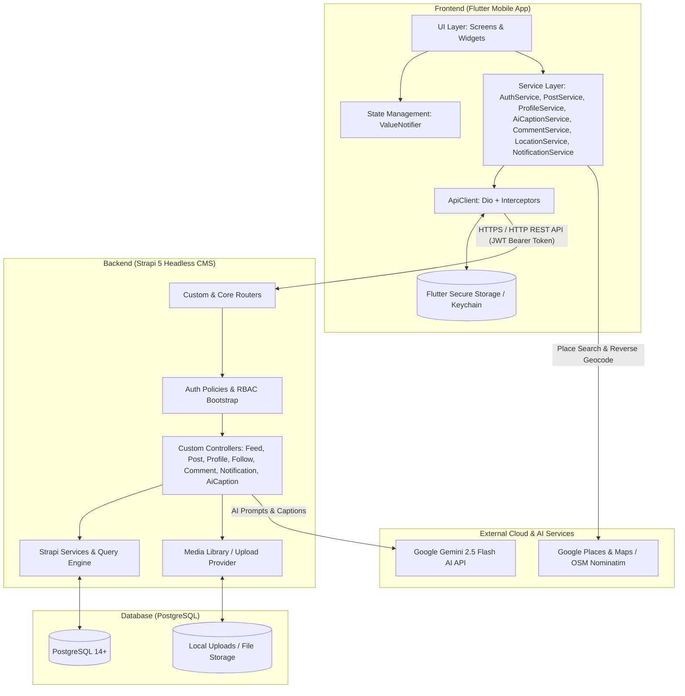
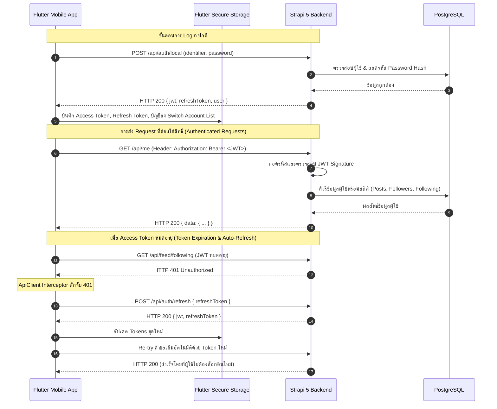

# 1. สถาปัตยกรรมระบบ (System Architecture) 🏛️

ระบบ **InstaCat** ถูกออกแบบและพัฒนาตามหลักการของ **3-Tier Client-Server Architecture** ผสานกับบริการ **AI & Cloud Location Services** โดยแยกส่วนการทำงานออกจากกันอย่างชัดเจน เพื่อความยืดหยุ่น ความปลอดภัย และประสิทธิภาพสูงสุด

---

## 1.1 ภาพรวมสถาปัตยกรรม (High-Level Architecture)



### รายละเอียดของแต่ละส่วน (Layers):
1. **Client Tier (Flutter Mobile App)**:
   - พัฒนาด้วย Flutter รองรับ iOS และ Android
   - จัดการ State แบบ Reactive ผ่าน `ValueNotifier` และ `ValueListenableBuilder`
   - เชื่อมต่อผ่าน `ApiClient` (Dio) ที่มี Interceptors สำหรับแนบ Token และทำ Auto-Refresh อัตโนมัติ
   - ปลอดภัยด้วย `FlutterSecureStorage` (iOS Keychain / Android EncryptedSharedPreferences)
2. **Application Tier (Strapi 5 Headless CMS)**:
   - ทำหน้าที่เป็น Business Logic Layer และ API Gateway พัฒนาด้วย TypeScript
   - จัดการระบบยืนยันตัวตน (Authentication) และสิทธิ์ผู้ใช้ (RBAC: Role-Based Access Control)
   - มี Custom Controllers ครอบคลุม: ฟีด (Feed), โพสต์ (Post), โปรไฟล์ (Profile), การติดตาม (Follow), ความคิดเห็น (Comment), การแจ้งเตือน (Notification), และตัวช่วยเขียนแคปชันอัจฉริยะ (AI Caption Generator)
   - เชื่อมต่อกับ **Google Gemini API** เพื่อวิเคราะห์รูปภาพและสร้างคำบรรยายโพสต์ตามอารมณ์/สไตล์ที่เลือก
3. **Data Tier (PostgreSQL & Media Storage)**:
   - จัดเก็บข้อมูลเชิงสัมพันธ์อย่างเป็นระบบบน PostgreSQL 14+
   - จัดเก็บไฟล์รูปภาพใน Media Library ของ Strapi
4. **External Services**:
   - **Google Gemini AI**: สร้างแคปชันแมวหลากหลายสไตล์ (น่ารัก, ตลก, กวนๆ, บทกวี)
   - **Google Places & OpenStreetMap**: ค้นหาพิกัดและสถานที่จริงทั่วโลกแบบ Full-Screen

---

## 1.2 วงจรการยืนยันตัวตนและความปลอดภัย (Authentication Lifecycle)

การยืนยันตัวตนใช้มาตรฐาน **JSON Web Token (JWT)** ร่วมกับ **Refresh Token** และจัดเก็บคีย์ลงใน Secure Storage ประจำเครื่อง



### การป้องกันข้อผิดพลาดทางเทคนิคที่สำคัญ:
* **In-Memory Token Cache**: เพื่อป้องกันปัญหา Asynchronous I/O Race Condition บน Keychain ตอนที่แอปเปิดเครื่องหรือเพิ่งล็อกอิน `ApiClient` จะแคช `_accessToken` ไว้ในหน่วยความจำ RAM ทำให้การยิง API หลังล็อกอินมี Token แนบไปใน Header ทันที 100%
* **Public Request Token Stripping**: สำหรับ Endpoint ที่ไม่ต้องการ Token เช่น `/api/auth/local` หรือ `/api/auth/local/register` Interceptor จะทำการตัด Authorization Header ทิ้ง เพื่อไม่ให้ Token เดิมที่อาจหมดอายุไปรบกวนคำขอนั้น

---

## 1.3 การจัดการที่อยู่เครือข่ายข้ามแพลตฟอร์ม (Network Configuration)

เนื่องจากระบบต้องรองรับการรันทั้งบน iOS Simulator, Android Emulator, และ Physical Device ที่มีวิธีการอ้างอิง Host แตกต่างกัน:

| แพลตฟอร์ม (Environment) | Base URL สำหรับเชื่อมต่อ Strapi | เหตุผลทางเทคนิค |
| :--- | :--- | :--- |
| **iOS Simulator / macOS** | `http://127.0.0.1:1337` | iOS Simulator แชร์ Loopback Network กับเครื่อง Mac Host ทำให้มองเห็น `127.0.0.1` ได้โดยตรง |
| **Android Emulator** | `http://10.0.2.2:1337` | Android QEMU Virtual Router กำหนด IP พิเศษ `10.0.2.2` เพื่อเชื่อมต่อไปยัง Loopback Interface ของคอมพิวเตอร์ Host |
| **Physical Device (มือถือจริง)** | `http://<LAN_IP>:1337` | ต้องระบุ Local IP ของคอมพิวเตอร์ในวง Wi-Fi เดียวกัน เช่น `http://192.168.1.50:1337` |

ระบบได้รวมตรรกะนี้ไว้ใน [api_config.dart](file:///Users/panya/Documents/ai-engineer-course/frontend/lib/services/api_config.dart):
```dart
static String get serverUrl {
  if (kIsWeb) return 'http://127.0.0.1:1337';
  if (defaultTargetPlatform == TargetPlatform.android) return 'http://10.0.2.2:1337';
  return 'http://127.0.0.1:1337';
}
```
และมีฟังก์ชัน `resolveImageUrl(String? url)` ในการแปลง Relative URL ของรูปภาพจาก Strapi (`/uploads/image.jpg`) ให้กลายเป็น Full URL ตาม Platform ที่กำลังทำงานอยู่โดยอัตโนมัติ

---

## 1.4 การจัดเก็บข้อมูลในระดับเครื่อง (Local Security & Storage Model)

แอปพลิเคชันใช้แพ็กเกจ `flutter_secure_storage` ในการเข้ารหัสข้อมูลสำคัญบนเครื่อง:
* **iOS**: เข้ารหัสและจัดเก็บลงใน **Apple Keychain Services** พร้อมตั้งค่า `KeychainAccessibility.first_unlock`
* **Android**: เข้ารหัสและจัดเก็บใน **EncryptedSharedPreferences** ร่วมกับ **Android KeyStore**

### ข้อมูลที่ถูกบันทึกไว้ใน Secure Storage:
1. `instacat_jwt`: Access Token ปัจจุบัน
2. `instacat_refresh_token`: Token สำหรับต่ออายุ Session
3. `instacat_last_user`: JSON ข้อมูลโปรไฟล์ของบัญชีล่าสุดที่ใช้งาน
4. `instacat_saved_accounts`: รายการบัญชีที่บันทึกไว้สำหรับสลับบัญชี (Switch Account Screen)
5. `instacat_last_identifier`: Username หรือ Email ของบัญชีล่าสุด
6. `instacat_last_password`: รหัสผ่านที่เข้ารหัสไว้เพื่อใช้ทำ Quick Re-Authentication
