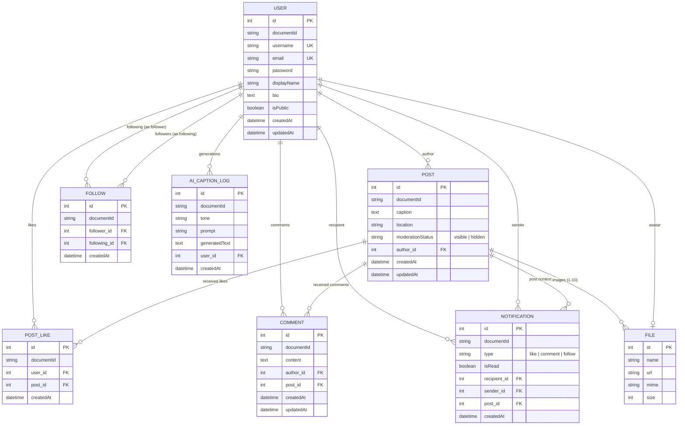

# 2. ระบบ Backend (Strapi 5 & PostgreSQL) ⚙️

ระบบ Backend ของ **InstaCat** ถูกพัฒนาขึ้นด้วย **Strapi 5 Headless CMS** บนสถาปัตยกรรม **TypeScript** และเชื่อมต่อกับฐานข้อมูลเชิงสัมพันธ์ **PostgreSQL** เพื่อบริหารจัดการข้อมูลและตรรกะทางธุรกิจ (Business Logic) ทั้งหมด

---

## 2.1 โครงสร้างฐานข้อมูลและความสัมพันธ์ (Entity-Relationship Model)

---

## 2.2 การขยาย User Schema (User Content-Type Extension)

ไฟล์คอนฟิก: [backend/src/extensions/users-permissions/content-types/user/schema.json](file:///Users/panya/Documents/ai-engineer-course/backend/src/extensions/users-permissions/content-types/user/schema.json)

เราได้ขยายโมเดลผู้ใช้มาตรฐานของ Strapi เพื่อรองรับฟีเจอร์สำหรับ Social Network ดังนี้:
* `displayName`: ชนิด `string` สำหรับเก็บชื่อที่ใช้แสดงผล
* `bio`: ชนิด `text` สำหรับข้อความประวัติส่วนตัว
* `isPublic`: ชนิด `boolean` ค่าเริ่มต้นคือ `true` กำหนดความเป็นส่วนตัวของบัญชี
* `avatar`: ความสัมพันธ์แบบ One-to-One ไปยัง Media Library (`plugin::upload.file`)
* `posts`: ความสัมพันธ์ One-to-Many ไปยัง `api::post.post`
* `likes`: ความสัมพันธ์ One-to-Many ไปยัง `api::post-like.post-like`
* `comments`: ความสัมพันธ์ One-to-Many ไปยัง `api::comment.comment`
* `following`: ความสัมพันธ์ One-to-Many ไปยัง `api::follow.follow` (ในฐานะผู้ติดตาม)
* `followers`: ความสัมพันธ์ One-to-Many ไปยัง `api::follow.follow` (ในฐานะผู้ถูกติดตาม)

---

## 2.3 โมเดลเนื้อหาและ Business Logic (Content-Types & Controllers)

### 1. โพสต์ (Post API)
* **โมเดล**: [schema.json](file:///Users/panya/Documents/ai-engineer-course/backend/src/api/post/content-types/post/schema.json)
  - `caption`: ข้อความบรรยายโพสต์
  - `location`: ข้อความระบุชื่อสถานที่ที่แท็ก (เช่น "Siam Paragon", "Bangkok, Thailand")
  - `images`: มัลติมีเดีย (รองรับ 1 ถึง 10 รูปภาพ)
  - `author`: ความสัมพันธ์เชื่อมโยงกับ `plugin::users-permissions.user`
  - `moderationStatus`: ข้อความประเภท Enum (`visible`, `hidden`) ค่าเริ่มต้นคือ `visible`
* **Custom Controller**: [post.ts](file:///Users/panya/Documents/ai-engineer-course/backend/src/api/post/controllers/post.ts)
  - กำหนดให้ `author` ผูกกับผู้ใช้ที่ล็อกอินอยู่ (`ctx.state.user.id`) โดยอัตโนมัติ และป้องกันไม่ให้ผู้ใช้ระบุ author_id ของผู้อื่น (Author Spoofing Prevention)
  - บังคับให้โพสต์ต้องมีรูปภาพระหว่าง 1 ถึง 10 รูป
  - การแก้ไข (`update`) หรือการลบ (`delete`) จะอนุญาตให้เฉพาะเจ้าของโพสต์ (`post.author.id === user.id`) หรือ Admin เท่านั้น

### 2. ความคิดเห็น (Comment API)
* **โมเดล**: `api::comment.comment`
  - `content`: ข้อความแสดงความคิดเห็น
  - `author`: ผู้เขียนความคิดเห็น
  - `post`: โพสต์เป้าหมาย
* **Controller**: [comment.ts](file:///Users/panya/Documents/ai-engineer-course/backend/src/api/comment/controllers/comment.ts)
* **Endpoints**:
  - `GET /api/comments?postId=:id`: ดึงรายการความคิดเห็นทั้งหมดของโพสต์ พร้อมข้อมูล avatar และ username ของผู้เขียน
  - `POST /api/comments`: สร้างความคิดเห็นใหม่ พร้อมสร้าง Notification ส่งไปยังเจ้าของโพสต์โดยอัตโนมัติ
  - `DELETE /api/comments/:id`: ลบความคิดเห็น (อนุญาตเฉพาะเจ้าของคอมเมนต์หรือเจ้าของโพสต์)

### 3. การแจ้งเตือน (Notification API)
* **โมเดล**: `api::notification.notification`
  - `type`: ประเภทการแจ้งเตือน (`like`, `comment`, `follow`)
  - `isRead`: สถานะการเปิดอ่าน
  - `sender`: ผู้กระทำการ
  - `recipient`: ผู้รับการแจ้งเตือน
  - `post`: โพสต์ที่เกี่ยวข้อง (สำหรับ like หรือ comment)
* **Controller**: [notification.ts](file:///Users/panya/Documents/ai-engineer-course/backend/src/api/notification/controllers/notification.ts)
* **Endpoints**:
  - `GET /api/notifications`: ดึงรายการแจ้งเตือนของผู้ใช้ปัจจุบัน เรียงจากใหม่ไปเก่า พร้อมนับ unread count
  - `PUT /api/notifications/:id/read`: อัปเดตสถานะเป็นอ่านแล้ว

### 4. ผู้ช่วยสร้างแคปชันอัจฉริยะ (AI Caption Generator API)
* **Controller**: [ai-caption.ts](file:///Users/panya/Documents/ai-engineer-course/backend/src/api/ai-caption/controllers/ai-caption.ts)
* **Endpoints**:
  - `POST /api/ai-caption/generate`: รับรูปภาพและคำค้นหา/สไตล์ (Tone: Cute, Funny, Sarcastic, Poetic, Trendy) แล้วเรียก **Google Gemini 2.5 Flash** เพื่อสร้างตัวเลือกแคปชันภาษาไทยและอังกฤษ พร้อมแฮชแท็กที่เหมาะสม
* **โมเดล Log**: `api::ai-caption-log.ai-caption-log` บันทึกประวัติการสร้างแคปชันสำหรับวิเคราะห์การใช้งาน

### 5. การกดถูกใจโพสต์ (PostLike API)
* **โมเดล**: [schema.json](file:///Users/panya/Documents/ai-engineer-course/backend/src/api/post-like/content-types/post-like/schema.json)
* **Controller**: [post-like.ts](file:///Users/panya/Documents/ai-engineer-course/backend/src/api/post-like/controllers/post-like.ts)
* **Routes**:
  - `POST /api/posts/:documentId/like`: ตรวจสอบว่าเคยกดไลก์ไปแล้วหรือไม่ หากยังไม่เคยจะทำการสร้าง Record การไลก์ใหม่ พร้อมส่งการแจ้งเตือน
  - `DELETE /api/posts/:documentId/like`: ลบ Record การไลก์ของผู้ใช้ออกจากโพสต์เป้าหมาย
  - ป้องกันการเกิด Duplicate Like จากการกดย้ำอย่างสมบูรณ์

### 6. การติดตามผู้ใช้งาน (Follow API)
* **โมเดล**: [schema.json](file:///Users/panya/Documents/ai-engineer-course/backend/src/api/follow/content-types/follow/schema.json)
* **Controller**: [follow.ts](file:///Users/panya/Documents/ai-engineer-course/backend/src/api/follow/controllers/follow.ts)
* **Routes**:
  - `POST /api/users/:documentId/follow`: ติดตามผู้ใช้เป้าหมาย พร้อมส่งการแจ้งเตือน
  - `DELETE /api/users/:documentId/follow`: ยกเลิกการติดตาม
  - ป้องกันการกดติดตามบัญชีตัวเองโดยเด็ดขาด (`SELF_FOLLOW_NOT_ALLOWED`)

### 7. ระบบฟีดข่าว (Feed API)
* **Controller**: [feed.ts](file:///Users/panya/Documents/ai-engineer-course/backend/src/api/feed/controllers/feed.ts)
* **Public Feed (`GET /api/feed/public`)**: กรองเฉพาะโพสต์ของบัญชีสาธารณะ (`author.isPublic = true`) เรียงจากใหม่ไปเก่า รองรับ Pagination และตรวจจับสถานะ `isLiked`, `commentCount`
* **Following Feed (`GET /api/feed/following`)**: ดึงเฉพาะโพสต์ของบุคคลที่กำลังติดตาม

### 8. ระบบโปรไฟล์และการค้นหาผู้ใช้ (Profile & Search API)
* **Controller**: [profile.ts](file:///Users/panya/Documents/ai-engineer-course/backend/src/api/profile/controllers/profile.ts)
* `GET /api/me`: ข้อมูลโปรไฟล์ของผู้ใช้ปัจจุบัน พร้อมนับยอดสถิติสด `postsCount`, `followersCount`, `followingCount`
* `PUT /api/me`: แก้ไข `displayName`, `bio`, `isPublic`, `avatar`, และ `username`
* `GET /api/profiles/search?q=:query`: ค้นหาบัญชีผู้ใช้จริงในระบบจาก `username` หรือ `displayName`
* `GET /api/profiles/:username`: ส่งคืนข้อมูลโปรไฟล์สาธารณะและสถานะ `isFollowing`
* `GET /api/profiles/:username/posts`: ส่งคืนรายการโพสต์ทั้งหมดของบัญชีนั้นๆ

---

## 2.4 การตั้งค่าสิทธิ์อัตโนมัติ (Permissions Bootstrap Lifecycle)

ไฟล์คอนฟิก: [backend/src/index.ts](file:///Users/panya/Documents/ai-engineer-course/backend/src/index.ts)

Strapi จะรันฟังก์ชัน `bootstrap()` อัตโนมัติทุกครั้งที่เริ่มรัน Server:
1. ปิดระบบ Email Confirmation (`email_confirmation = false`) เพื่อให้ผู้ใช้ที่สมัครสมาชิกสามารถใช้งานได้ทันที
2. ผูกสิทธิ์สำหรับ Role **`Public`**:
   - `post.find`, `post.findOne`, `feed.getPublicFeed`
   - `profile.getProfile`, `profile.getUserPosts`, `profile.searchUsers`
   - `comment.find`
3. ผูกสิทธิ์สำหรับ Role **`Authenticated`**:
   - ทุกสิทธิ์ของ Public
   - `post.create`, `post.update`, `post.delete`
   - `post-like.like`, `post-like.unlike`
   - `follow.follow`, `follow.unfollow`
   - `feed.getFollowingFeed`
   - `profile.getMe`, `profile.updateMe`
   - `comment.create`, `comment.delete`
   - `notification.find`, `notification.markRead`
   - `ai-caption.generate`
   - `upload.upload`, `upload.destroy`
