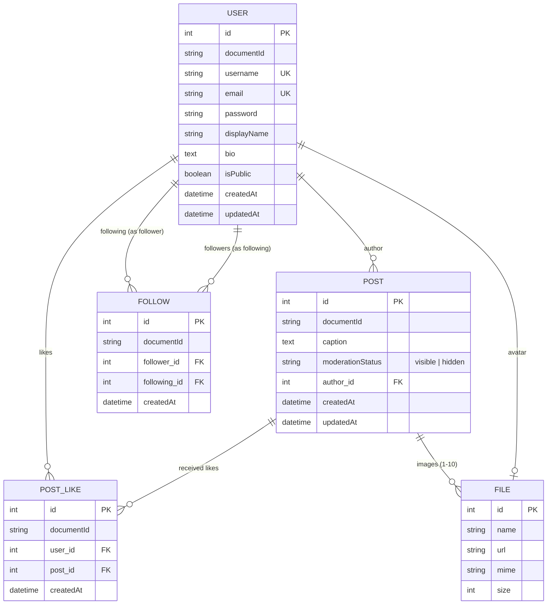

# 2. ระบบ Backend (Strapi 5 & PostgreSQL) ⚙️

ระบบ Backend ของ **InstaCat** ถูกพัฒนาขึ้นด้วย **Strapi 5 Headless CMS** บนสถาปัตยกรรม **TypeScript** และเชื่อมต่อกับฐานข้อมูลเชิงสัมพันธ์ **PostgreSQL** เพื่อบริหารจัดการข้อมูลและตรรกะทางธุรกิจ (Business Logic) ทั้งหมด

---

## 2.1 โครงสร้างฐานข้อมูลและความสัมพันธ์ (Entity-Relationship Model)

---

## 2.2 การขยาย User Schema (User Content-Type Extension)

ไฟล์คอนฟิก: [backend/src/extensions/users-permissions/content-types/user/schema.json](file:///Users/panya/Documents/ai-engineer-course/backend/src/extensions/users-permissions/content-types/user/schema.json)

เราได้ขยายโมเดลผู้ใช้มาตรฐานของ Strapi เพื่อรองรับฟีเจอร์สำหรับ Social Network ดังนี้:
* `displayName`: ชนิด `string` สำหรับเก็บชื่อที่ใช้แสดงผล
* `bio`: ชนิด `text` สำหรับข้อความประวัติส่วนตัว
* `isPublic`: ชนิด `boolean` ค่าเริ่มต้นคือ `true` กำหนดความเป็นส่วนตัวของบัญชี
* `avatar`: ความสัมพันธ์แบบ One-to-One ไปยัง Media Library (`plugin::upload.file`)
* `posts`: ความสัมพันธ์ One-to-Many ไปยัง `api::post.post`
* `likes`: ความสัมพันธ์ One-to-Many ไปยัง `api::post-like.post-like`
* `following`: ความสัมพันธ์ One-to-Many ไปยัง `api::follow.follow` (ในฐานะผู้ติดตาม)
* `followers`: ความสัมพันธ์ One-to-Many ไปยัง `api::follow.follow` (ในฐานะผู้ถูกติดตาม)

---

## 2.3 โมเดลเนื้อหาและ Business Logic (Content-Types & Controllers)

### 1. โพสต์ (Post API)
* **โมเดล**: [schema.json](file:///Users/panya/Documents/ai-engineer-course/backend/src/api/post/content-types/post/schema.json)
  - `caption`: ข้อความบรรยายโพสต์
  - `images`: มัลติมีเดีย (รองรับ 1 ถึง 10 รูปภาพ)
  - `author`: ความสัมพันธ์เชื่อมโยงกับ `plugin::users-permissions.user`
  - `moderationStatus`: ข้อความประเภท Enum (`visible`, `hidden`) ค่าเริ่มต้นคือ `visible`
* **Custom Controller**: [post.ts](file:///Users/panya/Documents/ai-engineer-course/backend/src/api/post/controllers/post.ts)
  - กำหนดให้ `author` ผูกกับผู้ใช้ที่ล็อกอินอยู่ (`ctx.state.user.id`) โดยอัตโนมัติ และป้องกันไม่ให้ผู้ใช้ระบุ author_id ของผู้อื่น (Author Spoofing Prevention)
  - บังคับให้โพสต์ต้องมีรูปภาพระหว่าง 1 ถึง 10 รูป
  - การแก้ไข (`update`) หรือการลบ (`delete`) จะอนุญาตให้เฉพาะเจ้าของโพสต์ (`post.author.id === user.id`) หรือ Admin เท่านั้น

### 2. การกดถูกใจโพสต์ (PostLike API)
* **โมเดล**: [schema.json](file:///Users/panya/Documents/ai-engineer-course/backend/src/api/post-like/content-types/post-like/schema.json)
* **Controller**: [post-like.ts](file:///Users/panya/Documents/ai-engineer-course/backend/src/api/post-like/controllers/post-like.ts)
* **Routes**:
  - `POST /api/posts/:documentId/like`: ตรวจสอบว่าเคยกดไลก์ไปแล้วหรือไม่ หากยังไม่เคยจะทำการสร้าง Record การไลก์ใหม่
  - `DELETE /api/posts/:documentId/like`: ลบ Record การไลก์ของผู้ใช้ออกจากโพสต์เป้าหมาย
  - ป้องกันการเกิด Duplicate Like จากการกดย้ำอย่างสมบูรณ์

### 3. การติดตามผู้ใช้งาน (Follow API)
* **โมเดล**: [schema.json](file:///Users/panya/Documents/ai-engineer-course/backend/src/api/follow/content-types/follow/schema.json)
* **Controller**: [follow.ts](file:///Users/panya/Documents/ai-engineer-course/backend/src/api/follow/controllers/follow.ts)
* **Routes**:
  - `POST /api/users/:documentId/follow`: ติดตามผู้ใช้เป้าหมาย
  - `DELETE /api/users/:documentId/follow`: ยกเลิกการติดตาม
  - **ตรรกะความปลอดภัย**:
    - ตรวจสอบห้ามผู้ใช้กดติดตามบัญชีตัวเองโดยเด็ดขาด (`SELF_FOLLOW_NOT_ALLOWED`)
    - ตรวจสอบความซ้ำซ้อนของการติดตาม

### 4. ระบบฟีดข่าว (Feed API)
* **Controller**: [feed.ts](file:///Users/panya/Documents/ai-engineer-course/backend/src/api/feed/controllers/feed.ts)
* **Public Feed (`GET /api/feed/public`)**:
  - เปิดให้เข้าถึงได้ทั้งผู้ใช้ทั่วไป (Guest) และผู้ใช้ที่ล็อกอินแล้ว
  - กรองเฉพาะโพสต์ที่เป็นของผู้ใช้ที่เป็นบัญชีสาธารณะ (`author.isPublic = true`) และมีสถานะ `moderationStatus = 'visible'`
  - เรียงลำดับจากโพสต์ใหม่ล่าสุดไปเก่าสุด (`createdAt:desc`)
  - รองรับ Pagination (`page`, `pageSize`)
  - หากมี Token ล็อกอิน จะทำการตรวจสอบสถานะ `isLiked` ของผู้ใช้ต่อแต่ละโพสต์ให้อัตโนมัติ
* **Following Feed (`GET /api/feed/following`)**:
  - ต้องมีการยืนยันตัวตน (Authenticated User)
  - ค้นหารายชื่อผู้ใช้ที่กำลังติดตาม (`following`) แล้วดึงเฉพาะโพสต์ของบุคคลเหล่านั้น

### 5. ระบบโปรไฟล์และการค้นหาผู้ใช้ (Profile & Search API)
* **Controller**: [profile.ts](file:///Users/panya/Documents/ai-engineer-course/backend/src/api/profile/controllers/profile.ts)
* **Endpoints**:
  - `GET /api/me`: ส่งคืนข้อมูลโปรไฟล์ของผู้ใช้ปัจจุบัน พร้อมนับยอดสถิติสดจากฐานข้อมูล ได้แก่ `postsCount`, `followersCount`, และ `followingCount`
  - `PUT /api/me`: รองรับการแก้ไข `displayName`, `bio`, `isPublic`, รูปภาพ `avatar`, และ **`username`**
    - เมื่อมีการแก้ไข `username` ระบบจะตรวจสอบความยาว (อย่างน้อย 3 ตัวอักษร), ตัวอักษรที่อนุญาต, และตรวจเช็กความซ้ำซ้อนกับผู้ใช้อื่นในระบบอย่างรัดกุม
  - `GET /api/profiles/search?q=:query`: ค้นหาบัญชีผู้ใช้จริงในระบบจาก `username` หรือ `displayName` แบบ Case-insensitive พร้อมส่งคืนข้อมูล Avatar, สถิติโพสต์ และยอดผู้ติดตาม
  - `GET /api/profiles/:username`: ส่งคืนข้อมูลโปรไฟล์สาธารณะของผู้ใช้ พร้อมระบุว่าผู้เรียกกำลังติดตามอยู่หรือไม่ (`isFollowing`)
  - `GET /api/profiles/:username/posts`: ส่งคืนรายการโพสต์ทั้งหมดของบัญชีนั้นๆ พร้อมนับยอดไลก์และสถานะการไลก์ เรียงจากใหม่ไปเก่า เพื่อนำไปแสดงในตาราง Profile Grid

---

## 2.4 การตั้งค่าสิทธิ์อัตโนมัติ (Permissions Bootstrap Lifecycle)

ไฟล์คอนฟิก: [backend/src/index.ts](file:///Users/panya/Documents/ai-engineer-course/backend/src/index.ts)

เพื่อตัดปัญหาเรื่องการต้องไปตั้งค่าสิทธิ์ผ่าน Strapi Admin UI ด้วยตนเอง Strapi จะรันฟังก์ชัน `bootstrap()` อัตโนมัติทุกครั้งที่เริ่มรัน Server:
1. ปิดระบบ Email Confirmation (`email_confirmation = false`) เพื่อให้ผู้ใช้ที่สมัครสมาชิกผ่านแอปสามารถเข้าสู่ระบบและได้รับ JWT ทันที
2. ผูกสิทธิ์สำหรับ Role **`Public`**:
   - `post.find`, `post.findOne`
   - `feed.getPublicFeed`
   - `profile.getProfile`, `profile.getUserPosts`, `profile.searchUsers`
3. ผูกสิทธิ์สำหรับ Role **`Authenticated`**:
   - ทุกสิทธิ์ของ Public
   - `post.create`, `post.update`, `post.delete`
   - `post-like.like`, `post-like.unlike`
   - `follow.follow`, `follow.unfollow`
   - `feed.getFollowingFeed`
   - `profile.getMe`, `profile.updateMe`
   - `upload.upload`, `upload.destroy`
