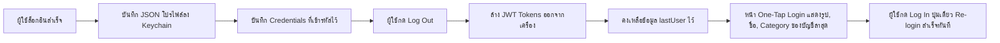

# 3. ระบบ Frontend (Flutter Mobile Application) 📱

ส่วนติดต่อผู้ใช้งาน (Mobile Client) ของ **InstaCat** ถูกพัฒนาขึ้นด้วย **Flutter** โดยเน้นความสวยงาม ทันสมัยตามหลัก Instagram Design System รองรับการตอบสนองแบบ Reactive และมีระบบสถาปัตยกรรมโค้ดที่แยกส่วนชัดเจน

---

## 3.1 โครงสร้างโฟลเดอร์ของโปรเจกต์ (Directory Structure)

```
frontend/lib/
├── main.dart                 # จุดเริ่มต้นของแอปพลิเคชันและการตรวจสอบ Session
├── models/
│   └── models.dart           # Data Models: CatUser, Post, Comment, NotificationItem
├── services/
│   ├── api_config.dart       # Network URLs & Image Resolution
│   ├── api_client.dart       # Dio HTTP Client, Secure Storage & Interceptors
│   ├── auth_service.dart     # Authentication & Last Logged-in User Management
│   ├── post_service.dart     # Post creation, Feeds, Likes, and Compression
│   └── profile_service.dart  # Profile Management, Following, and Avatar Upload
├── theme/
│   ├── colors.dart           # InstaCat Brand Colors (Orange primary, Gradients)
│   ├── typography.dart       # Inter Font Typography Tokens
│   └── app_theme.dart        # Material 3 Theme Definition
├── screens/
│   ├── one_tap_login_screen.dart # หน้า One-Tap Quick Login แสดงบัญชีจริงล่าสุด
│   ├── login_screen.dart         # หน้า Login ปกติ (สะอาด ไม่มี predata)
│   ├── register_screen.dart      # หน้าสมัครสมาชิกใหม่พร้อมการตรวจสอบข้อมูล
│   ├── main_shell.dart           # Shell ครอบ Bottom Navigation Bar 5 แท็บ
│   ├── feed_screen.dart          # หน้า Feed ข่าวสาร (Infinite Scroll & Pull-to-refresh)
│   ├── explore_screen.dart       # หน้าค้นหาและสำรวจรูปภาพ
│   ├── create_post_screen.dart   # หน้าสร้างโพสต์และเลือกหลายรูปภาพ
│   ├── edit_post_screen.dart     # หน้าแก้ไขคำบรรยายโพสต์
│   ├── notification_screen.dart  # หน้ารายการแจ้งเตือน
│   ├── direct_messages_screen.dart # หน้าข้อความแชท
│   ├── profile_screen.dart       # หน้าโปรไฟล์พร้อมตารางโพสต์รูปภาพ
│   └── edit_profile_screen.dart  # หน้าแก้ไขข้อมูลโปรไฟล์และรูป Avatar
└── widgets/                  # Reusable UI Components (PostCard, StoryBar, etc.)
```

---

## 3.2 การจัดการ State (State Management)

แอปพลิเคชันใช้แนวทาง **Reactive ValueNotifier** ร่วมกับ **StatefulWidget Lifecycle** ซึ่งมีประสิทธิภาพสูงและกินทรัพยากรน้อย:
* `AuthService().currentUserNotifier`: เป็น `ValueNotifier<CatUser?>` คอยกระจายสถานะผู้ใช้ที่ล็อกอินอยู่
* ใน `main.dart` ใช้ `ValueListenableBuilder` คอยฟังค่า `currentUserNotifier`:
  - หากมีค่า (`user != null`) → แสดงผลหน้า `MainShell` (แอปหลัก)
  - หากเป็นค่าว่าง (`user == null`) → แสดงผลหน้า `OneTapLoginScreen` (หน้าล็อกอิน)

```dart
ValueListenableBuilder<CatUser?>(
  valueListenable: AuthService().currentUserNotifier,
  builder: (context, user, child) {
    if (user != null) {
      return MainShell(key: ValueKey(user.id));
    }
    return const OneTapLoginScreen();
  },
)
```

---

## 3.3 ระบบบริการ (Service Layer Architecture)

### 1. ApiClient (`api_client.dart`)
- ใช้ **Dio** เป็น HTTP Client หลัก
- **In-Memory Cache**: เก็บ Token ในตัวแปร `_accessToken` เพื่อให้ส่งคำขอได้ทันทีโดยไม่ต้องรออ่าน Keychain แบบ Asynchronous ทุกครั้ง
- **Request Interceptor**: แนบ `Authorization: Bearer <token>` ให้อัตโนมัติ ยกเว้นคำขอ Public
- **Response & Error Interceptor**: ดักจับ HTTP 401 Unauthorized หากพบว่า Token หมดอายุ จะทำการเรียก `/api/auth/refresh` เพื่อขอ Token ใหม่ และ Retry คำขอเดิมให้อัตโนมัติ

### 2. AuthService (`auth_service.dart`)
- รับผิดชอบกระบวนการ Authentication:
  - `login(identifier, password)`: ล็อกอินผ่าน API, อัปเดต Tokens และบันทึกข้อมูลเป็นบัญชีล่าสุด
  - `register(username, email, password)`: สมัครสมาชิกและเข้าสู่ระบบทันที
  - `logout()`: ยิง API Logout, ล้าง Tokens ในหน่วยความจำ และรีเซ็ตสถานะหน้าจอ
  - `saveLastUser(user, {identifier, password})`: บันทึกข้อมูลโปรไฟล์และรหัสผ่านของบัญชีล่าสุดลง Secure Storage
  - `loadLastUser()`: โหลดข้อมูลบัญชีล่าสุดขึ้นมาเพื่อใช้แสดงในหน้า One-Tap Login
  - `currentUserNotifier`: แจ้งเตือนการเปลี่ยนแปลงผู้ใช้งานไปยังทุกส่วนของแอป

### 3. PostService (`post_service.dart`)
- `getPublicFeed(page, pageSize)`: ดึงฟีดสาธารณะ
- `getFollowingFeed(page, pageSize)`: ดึงฟีดของผู้ที่กำลังติดตาม
- `uploadImages(List<File>)`: ลดขนาดรูปภาพด้วย `FlutterImageCompress` ก่อนส่งไฟล์ Multipart ไปยัง `/api/upload`
- `createPost(caption, imageIds)`: สร้างโพสต์ใหม่พร้อมเชื่อมโยง Media ID
- `toggleLike(postDocumentId, currentLiked)`: จัดการสถานะ Like แบบ Optimistic UI

### 4. ProfileService (`profile_service.dart`)
- `getMe()`: ดึงข้อมูลโปรไฟล์ของตนเองพร้อมสถิติสด
- `updateMe(...)`: ส่งคำขออัปเดตข้อมูลผู้ใช้ รวมถึง `username`
- `getUserPosts(username)`: ดึงรายการโพสต์ทั้งหมดของบัญชีที่ระบุ
- `uploadAvatar(File)`: บีบอัดภาพและอัปโหลดเป็นรูปโปรไฟล์

---

## 3.4 ระบบจดจำบัญชีล่าสุด (Last Logged-in User Persistence)

หนึ่งในฟังก์ชันเด่นคือการจำลองประสบการณ์ One-Tap Login เหมือน Instagram ของจริง:



* **ความยืดหยุ่น**: หากผู้ใช้ต้องการเปลี่ยนไปใช้บัญชีอื่น สามารถกดปุ่ม **"Switch accounts"** เพื่อเปิดหน้า [LoginScreen](file:///Users/panya/Documents/ai-engineer-course/frontend/lib/screens/login_screen.dart) ปกติได้ทันที
* **ความสะอาดของหน้าจอ**: ในหน้า `LoginScreen` จะเริ่มต้นด้วยช่องกรอกที่ว่างเปล่า 100% (ไม่มีการใส่ข้อมูลค้างไว้) เพื่อความปลอดภัยและความเป็นส่วนตัว

---

## 3.5 การอัปเดต Username แบบทันที (Real-time Reflection)

เมื่อผู้ใช้แก้ไข Username ในหน้า `EditProfileScreen`:
1. ส่งคำขอ `PUT /api/me` พร้อมชื่อผู้ใช้ใหม่
2. เมื่อเซิร์ฟเวอร์ตอบรับสำเร็จ จะอัปเดต `AuthService().currentUserNotifier` ทันที
3. ส่งอ็อบเจกต์ `CatUser` ใหม่กลับมายัง `ProfileScreen`
4. `ProfileScreen` สั่ง `setState` ทำให้ Title บน AppBar เปลี่ยนเป็นชื่อใหม่ทันที โดยไม่ต้องรอรีสตาร์ตแอป
5. สั่งรีเฟรชรายการโพสต์ของตนเองด้วยชื่อใหม่ เพื่อให้โพสต์ยังคงแสดงผลอย่างต่อเนื่อง
