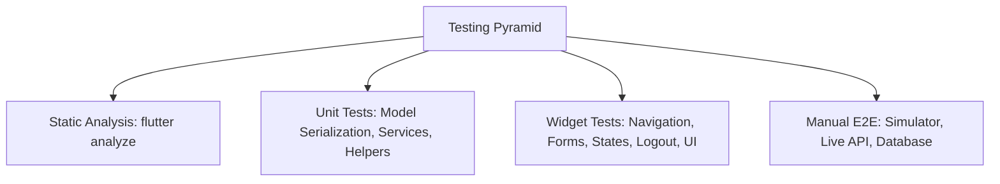

# 6. การทดสอบและการรับประกันคุณภาพ (Testing & QA) 🧪

โปรเจกต์ **InstaCat** มีกระบวนการทดสอบทั้งในระดับ **Unit Test**, **Widget Test**, **Static Analysis** และ **Manual End-to-End Verification** บนเครื่อง Simulator จริง เพื่อให้มั่นใจว่าทุกฟังก์ชันทำงานถูกต้อง 100% ตามข้อกำหนดใน [spec.md](../spec/spec.md)

---

## 6.1 กลยุทธ์การทดสอบ (Testing Strategy)



1. **Static Analysis**: ตรวจสอบคุณภาพโค้ด ไวยากรณ์ และ Linter Rules อย่างเคร่งครัด
2. **Unit Tests**: ทดสอบฟังก์ชันการแปลงข้อมูล (JSON Serialization), การต่อ URL รูปภาพ, การจัดเก็บ Token ลง Secure Storage
3. **Widget Tests**: จำลองการเรนเดอร์ Widget, การพิมพ์ข้อความ, การกดปุ่ม, การตรวจสอบ Form Validation, การสลับหน้าจอ และการทำงานร่วมกับ State
4. **Manual Verification**: รันแอปพลิเคชันจริงบน iOS Simulator โดยเชื่อมต่อกับ Strapi 5 และ PostgreSQL จริง

---

## 6.2 สรุปผลการทดสอบอัตโนมัติ (Automated Tests Suite)

คำสั่งที่ใช้รันการทดสอบ:
```bash
cd frontend
flutter analyze
flutter test
```

### ผลลัพธ์:
* **`flutter analyze`**: **No issues found!** (ผ่าน 100% ปราศจาก Warning หรือ Lint error)
* **`flutter test`**: **27 / 27 Tests Passed!** (ผ่านทั้งหมด 27 การทดสอบ)

---

## 6.3 รายละเอียดของ Test Cases ทั้ง 22 ชุด

### กลุ่มที่ 1: Service & Data Model Unit Tests (`frontend/test/services_test.dart`)
1. **Resolve Relative Image URLs**: ตรวจสอบว่า `ApiConfig.resolveImageUrl` สามารถแปลง Path สัมพัทธ์ของ Strapi เช่น `/uploads/cat.jpg` ให้กลายเป็น Full URL ตาม Host ได้อย่างถูกต้อง
2. **Unwrap Wrapped Response Structure**: ตรวจสอบว่า `CatUser.fromJson` สามารถแกะข้อมูลแบบซ้อน เช่น `{"data": {...}}` หรือ `{"user": {...}}` จาก Strapi ได้โดยไม่เกิด Null Exception
3. **CatUser Model Serialization**: ทดสอบ Round-trip การแปลง `CatUser -> toJson() -> fromJson()` เพื่อให้มั่นใจว่าข้อมูลโปรไฟล์ครบถ้วน
4. **Save Last User Persistence**: ตรวจสอบว่าฟังก์ชัน `saveLastUser` ใน `AuthService` สามารถบันทึกและอัปเดตข้อมูลบัญชีล่าสุดใน Memory และ Secure Storage ได้ถูกต้อง

### กลุ่มที่ 2: Widget & Integration Tests (`frontend/test/widget_test.dart`)
5. **Initial Boot & OneTapLoginScreen**: ตรวจสอบว่าเปิดแอปมาพบหน้า One-Tap Login และแสดงข้อมูลบัญชีล่าสุด
6. **Navigation to Login Screen**: ทดสอบการกดปุ่ม "Switch accounts" เพื่อเปิดหน้า Login Screen
7. **Clean Login Screen (No Predata)**: ตรวจสอบว่าช่อง Username และ Password ในหน้า Login Screen เริ่มต้นด้วยความว่างเปล่าเสมอ ไม่มีข้อมูลค้างไว้
8. **Navigation via Back Button (`Icons.chevron_left`)**: ทดสอบการกดย้อนกลับจากหน้า Login Screen กลับมายัง One-Tap Login Screen ด้วยปุ่มลูกศรมาตรฐานที่มุมบนซ้าย
9. **Explore Screen Search Bar**: ตรวจสอบการเรนเดอร์ Search Bar ในหน้า Explore
10. **Notification Screen Navigation**: ตรวจสอบการกดไอคอนกระดิ่งเพื่อเปิดหน้าแจ้งเตือน
11. **Register Screen Navigation**: ทดสอบการกด "Sign up." เพื่อเปิดหน้าสมัครสมาชิก
12. **Register Form Validation (Required Fields)**: ตรวจสอบระบบเตือนเมื่อผู้ใช้กรอกข้อมูลไม่ครบ เช่น ไม่ใส่ Email หรือรหัสผ่านสั้นเกินไป
13. **Register Password Mismatch Validation**: ตรวจสอบการแจ้งเตือนเมื่อ Password และ Confirm Password ไม่ตรงกัน
14. **Bottom Navigation Switching**: ตรวจสอบการสลับแท็บ Feed, Explore, Create, Activity, Profile ใน MainShell
15. **Like Button Optimistic Toggle**: ตรวจสอบการกด Like และ Unlike โพสต์ที่มีการอัปเดตตัวเลขทันที
16. **Post Caption Edit Modal**: ตรวจสอบการเปิด Dialog เพื่อแก้ไขข้อความบรรยายโพสต์ของตนเอง
17. **Profile Stats Display**: ตรวจสอบการแสดงสถิติ Posts, Followers, Following
18. **User Posts Grid Render**: ตรวจสอบการแสดงภาพโพสต์ของผู้ใช้ในหน้า Profile
19. **Real-time Username Edit Reflection**: ทดสอบการแก้ไข Username ในหน้า Edit Profile และยืนยันว่าหน้า ProfileScreen อัปเดตชื่อใหม่บน AppBar และ Header ทันทีโดยไม่ต้องรีสตาร์ต
20. **Logout Confirmation Dialog**: ตรวจสอบว่าเมื่อกด Logout จะมี Dialog ยืนยัน ("Are you sure you want to log out?") แสดงขึ้นมา
21. **Logout Flow Execution**: ตรวจสอบว่าเมื่อกดยืนยัน Logout แอปจะล้าง Token และพากลับมาหน้า One-Tap Login Screen อย่างถูกต้อง
22. **Remember Last Logged-in User Across Logout**: ทดสอบการจำลองกระบวนการ Login → แก้ไขชื่อเป็น `persian_king` → กด Log Out → ตรวจสอบว่าหน้า One-Tap Login Screen จดจำและนำชื่อ `persian_king` มาแสดงเป็นบัญชี One-Tap อย่างถูกต้อง

---

## 6.4 รายการตรวจสอบการทดสอบด้วยตนเอง (Manual QA Checklist)

| รายการทดสอบ (Test Scenario) | การทำงานที่คาดหวัง (Expected Result) | สถานะ (Status) |
| :--- | :--- | :---: |
| **1. One-Tap Login** | แสดงชื่อ, Avatar, Category ของผู้ใช้จริงล่าสุด และกดเข้าสู่ระบบได้ทันที | ✅ ผ่าน (Verified) |
| **2. Clean Login Form** | ช่องกรอกว่างเปล่า ไม่มี `testcat` ค้างไว้ เพื่อความปลอดภัย | ✅ ผ่าน (Verified) |
| **3. Back Button on Login** | มีปุ่ม `<` มุมบนซ้าย และไม่มีปุ่ม One-Tap ซ้ำซ้อนด้านล่าง | ✅ ผ่าน (Verified) |
| **4. User Registration** | สมัครสมาชิกสำเร็จ ตรวจสอบอีเมลซ้ำ และพาเข้าสู่ระบบทันที | ✅ ผ่าน (Verified) |
| **5. Post Photos Grid** | ภาพที่โพสต์ใหม่จะขึ้นแสดงในตารางหน้า Profile ทันที | ✅ ผ่าน (Verified) |
| **6. Edit Username** | แก้ไขแล้วบันทึกลงฐานข้อมูล และเปลี่ยนชื่อบนหน้าจอทันที | ✅ ผ่าน (Verified) |
| **7. Safe Logout** | มี Confirm Dialog ป้องกันการกดผิด และล้าง Session สมบูรณ์ | ✅ ผ่าน (Verified) |
