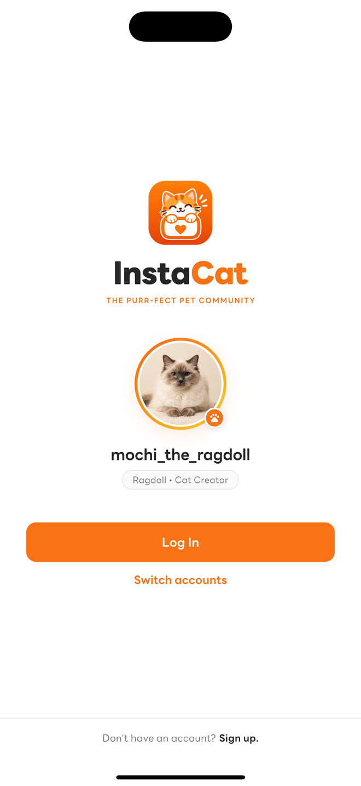
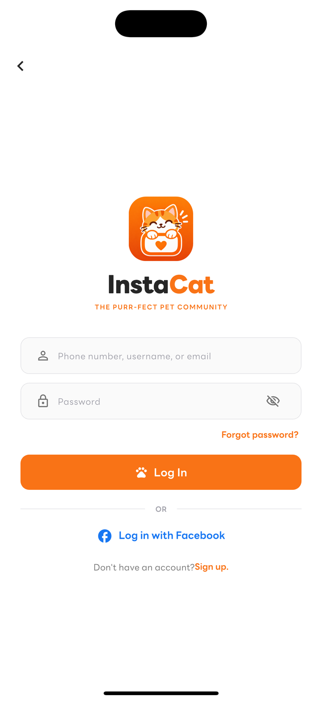
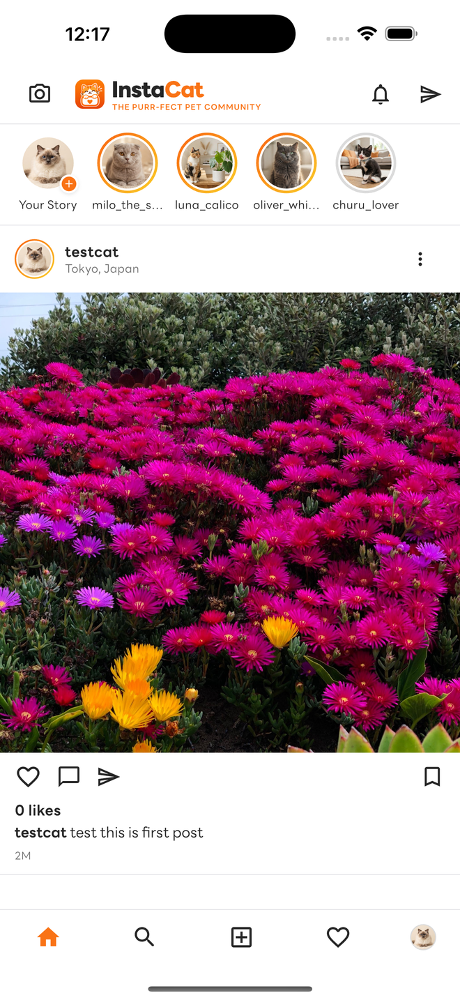
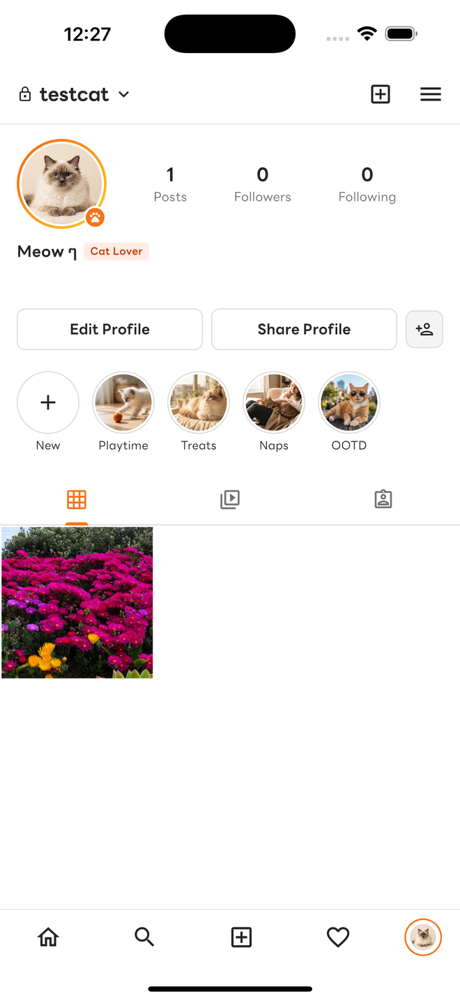

# InstaCat Documentation (คู่มือและเอกสารประกอบโปรเจกต์) 🐾

ยินดีต้อนรับสู่ศูนย์รวมเอกสารทางเทคนิคของโปรเจกต์ **InstaCat** ซึ่งเป็นโซเชียลมีเดียสำหรับคนรักแมว (Cat Social Network Application) ที่ถูกพัฒนาขึ้นอย่างสมบูรณ์แบบตามข้อกำหนดใน [spec.md](../spec/spec.md) และ [ai-caption-generator-spec.md](../spec/ai-caption-generator-spec.md)

ระบบได้รับการออกแบบและพัฒนาด้วยสถาปัตยกรรมแบบ **3-Tier Architecture** เชื่อมต่อระหว่าง Mobile Application (Flutter), Headless CMS Backend (Strapi 5), Relational Database (PostgreSQL) และ External Cloud Services (**Google Gemini 2.5 Flash AI** & **Google Maps / Places API**)

---

## 📸 ภาพรวมหน้าจอหลักของแอปพลิเคชัน

| 1. Switch Account Screen | 2. Clean Login Screen | 3. Register Screen | 4. Profile & Posts Grid |
| :---: | :---: | :---: | :---: |
|  |  |  |  |

---

## 📚 สารบัญเอกสาร (Table of Contents)

เอกสารในโฟลเดอร์นี้ถูกแบ่งออกเป็นหมวดหมู่ตามหัวข้อทางเทคนิคอย่างละเอียด ดังนี้:

### [1. สถาปัตยกรรมระบบ (System Architecture)](01_architecture.md)
- ภาพรวมสถาปัตยกรรม 3-Tier Model (Flutter ↔ Strapi 5 ↔ PostgreSQL ↔ Gemini AI / Google Maps)
- ไดอะแกรมลำดับการทำงาน (Sequence & Data Flow Diagram)
- ระบบความปลอดภัยและการจัดการ Token (JWT, Refresh Token, Secure Storage)
- การจัดการ Network IP Configuration ระหว่าง iOS Simulator, Android Emulator, และ Localhost

### [2. ระบบ Backend (Strapi 5 & PostgreSQL)](02_backend_strapi.md)
- การตั้งค่าและการขยาย User Schema ใน Strapi
- Content-Types และโมเดลความสัมพันธ์ (Post, PostLike, Comment, Notification, Follow, User, AiCaptionLog)
- Custom Controllers: Feeds, Posts, Comments, Notifications, Profiles, และ AI Caption Generator
- Automated Permissions Bootstrap Lifecycle (`src/index.ts`)
- การจัดการไฟล์มัลติมีเดีย (Media Library & Uploads)

### [3. ระบบ Frontend (Flutter Mobile Application)](03_frontend_flutter.md)
- โครงสร้างโค้ดและการจัดระเบียบไดเรกทอรี (`frontend/lib/`)
- การจัดการ State ด้วย `ValueNotifier` และ Reactive UI
- Service Layer Architecture (`ApiClient`, `AuthService`, `PostService`, `ProfileService`, `AiCaptionService`, `CommentService`, `LocationService`, `NotificationService`)
- หน้าจอและการทำงานของ UI Flow ทั้งหมด (Switch Account, AI Caption Generator, Multi-photo Gallery Picker, Full-page Location Search)

### [4. ข้อมูลอ้างอิง API (API Reference Specification)](04_api_reference.md)
- เอกสาร REST API ทุก Endpoint อย่างละเอียด
- Endpoints สำหรับ Authentication (`/api/auth/*`)
- Endpoints สำหรับ Feed (`/api/feed/*`), Posts (`/api/posts/*`), Likes (`/api/posts/:id/like`)
- Endpoints สำหรับ Comments (`/api/comments/*`) และ Notifications (`/api/notifications/*`)
- Endpoints สำหรับ AI Caption Generator (`/api/ai-caption/*`)
- Endpoints สำหรับ Profile และ Follows (`/api/profiles/*`, `/api/me`, `/api/users/*`)

### [5. คู่มือการติดตั้งและรันระบบ (Setup & Deployment Guide)](05_setup_guide.md)
- สิ่งที่ต้องติดตั้งล่วงหน้า (Prerequisites)
- ขั้นตอนการตั้งค่า PostgreSQL Database
- ขั้นตอนการติดตั้งและรัน Strapi Backend พร้อมตั้งค่า `GEMINI_API_KEY`
- ขั้นตอนการติดตั้งและรัน Flutter Frontend บน iOS Simulator / Android พร้อมระบุ `GOOGLE_MAPS_API_KEY`
- บันทึกการแก้ไขปัญหาที่พบบ่อย (Troubleshooting FAQ)

### [6. การทดสอบและการรับประกันคุณภาพ (Testing & QA)](06_testing_and_verification.md)
- กลยุทธ์การทดสอบอัตโนมัติ (Automated Testing Strategy)
- รายละเอียด Unit Tests และ Widget Tests ทั้งหมด 27 ชุด
- ผลการทดสอบจริง (`flutter test`, `flutter analyze`)
- รายละเอียดบัญชีทดสอบในระบบ (Test Accounts & Credentials)

---

## 🛠 เทคโนโลยีที่ใช้ในโปรเจกต์ (Technology Stack)

| ส่วนของระบบ (Layer) | เทคโนโลยีหลัก (Technologies) | รายละเอียด (Details) |
| :--- | :--- | :--- |
| **Frontend** | **Flutter 3.x / Dart** | รองรับ iOS และ Android, Material 3 Design |
| **AI Assistant** | **Google Gemini 2.5 Flash** | สร้างคำบรรยายโพสต์อัจฉริยะตามอารมณ์/สไตล์ |
| **Location & Maps** | **Google Maps & Places / OSM** | ค้นหาสถานที่แบบ Full-Screen, Reverse Geocoding, GPS |
| **Networking & HTTP** | **Dio 5.x** | Custom Interceptors, Auto Refresh Token, Multipart Upload |
| **Local Storage** | **Flutter Secure Storage** | บันทึก JWT Tokens, รหัสผ่าน และบัญชีผู้ใช้สำหรับ Switch Account |
| **Backend Framework** | **Strapi 5 Headless CMS** | TypeScript, Custom REST APIs, Lifecycle Hooks |
| **Database** | **PostgreSQL 14+** | Relational Database, Foreign Keys, Indexing |
| **Image Processing** | **Flutter Image Compress** | ลดขนาดภาพอัตโนมัติ (JPEG 85%, Max 2048px) ก่อนอัปโหลด |
| **Version Control** | **Git / GitHub** | Branch `main`, Semantic Commit Messages |

---

## 💡 สรุปฟังก์ชันการทำงานที่พัฒนาเสร็จสมบูรณ์

1. **Authentication & Multi-Account Management**:
   - สมัครสมาชิกใหม่ (Register) พร้อม Form Validation และ Error banner แจ้งเตือน
   - ล็อกอินด้วยบัญชีจริง (`testcat` / `password123` หรือบัญชีที่สมัครใหม่)
   - หน้า Switch Account จดจำรายการบัญชีผู้ใช้บนเครื่อง สลับใช้งานได้อย่างสะดวกรวดเร็ว
   - ระบบจัดเก็บ Token ลง Keychain/Secure Storage พร้อมการ Refresh Token อัตโนมัติ
   - การ Logout ออกจากระบบอย่างปลอดภัย พร้อม Confirm Dialog และล้าง Token

2. **Feed & Exploration**:
   - Public Feed ดึงโพสต์สาธารณะจาก Strapi เรียงจากใหม่ไปเก่า พร้อม Pagination
   - Following Feed แสดงเฉพาะโพสต์ของเพื่อนที่ติดตาม
   - ดึงข้อมูล Like status (`isLiked`) และ Like count แบบ Real-time
   - ระบบ Optimistic UI สำหรับการกดถูกใจ/ยกเลิกถูกใจ (Like / Unlike)
   - ผู้เขียนโพสต์สามารถแก้ไขคำบรรยาย (Edit Caption), แก้ไขสถานที่ หรือลบโพสต์ได้

3. **Post Creation & Rich Media**:
   - เลือกภาพได้ 1 ถึง 10 ภาพ ผ่าน Gallery Picker สไตล์ Instagram
   - ย่อขนาดภาพอัตโนมัติก่อนส่งขึ้นเซิร์ฟเวอร์เพื่อประหยัด Bandwidth
   - **AI Caption Assistant**: ผู้ช่วยสร้างคำบรรยายด้วย Google Gemini พร้อมเลือกอารมณ์ 5 สไตล์
   - **Location Picker**: ค้นหาสถานที่แบบ Full-Screen ปักหมุด หรือเลือกชื่อสถานที่ที่กำหนดเอง
   - **Tag Friends**: ระบบแท็กเพื่อนในโพสต์

4. **Comments & Social Activity**:
   - ระบบแสดงความคิดเห็นใต้โพสต์แบบ Real-time พร้อมนับจำนวนคอมเมนต์
   - ระบบแจ้งเตือน (Notifications) แสดงกิจกรรมการกดไลก์ คอมเมนต์ และการติดตามใหม่

5. **Profile & Social**:
   - หน้าโปรไฟล์ดึงข้อมูลสถิติสดจากเซิร์ฟเวอร์ (จำนวน Posts, Followers, Following)
   - แท็บแสดงตารางโพสต์รูปภาพของผู้ใช้ พร้อม Pull-to-Refresh
   - แก้ไขโปรไฟล์ (Display Name, Bio, สถานะบัญชีส่วนตัว/สาธารณะ, รูป Avatar, และ **Username**)
   - ระบบ Follow / Unfollow ระหว่างผู้ใช้งาน พร้อมระบบป้องกันการ Follow ตัวเอง
